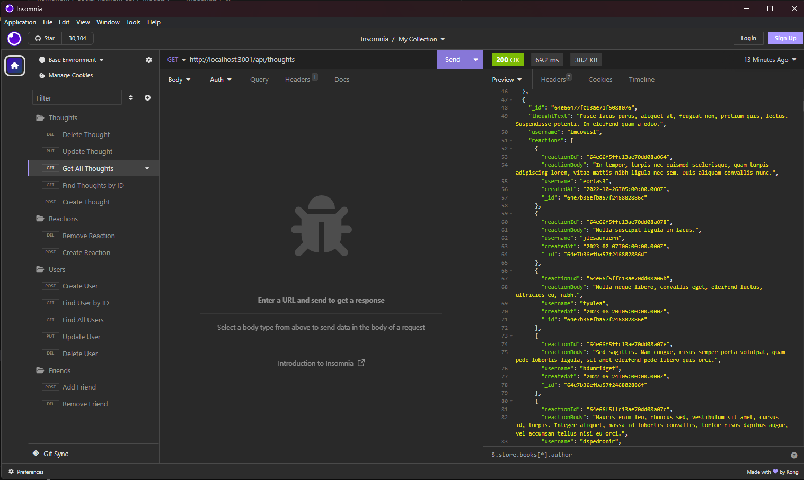

# Social Media API
The following is a back-end API web application intended for a social media platform utilizing a NoSQL Database. This web application was designed with MongoDB databases and Mongoose, a node.js based Object Data Modeling (ODM) library. 

## Purpose of Assignment
- The main focus of this assignment was to create a working back-end for a social media web application.
- This web app is seeded with dummy users, thoughts, and reactions to test all of the back-end routing with the server. 
- This app will have working GET routes for finding all thoughts and users, and also finding thoughts and users by their unique ID.
- There will also be routes to create, update and delete both thoughts and users by ID.
- Finally, there will be working routes for adding and deleting friends, and reactions with this web application.
- The final product is a web application that just needs front end design to become a working social media web application. 

## Instructions for the User
 - Please use app and comment on any errors.

## Screen Shot of Working Application

## Link to GitHub Repository
[Click Here to View GitHub Repo](https://github.com/Aidan-Windebank/social-network-api)

## Link to Screencast Video to See Application in Use
[Click Here to View Video](https://drive.google.com/file/d/1V6q0ZZEj76pE4A_Gg8k011PENBdCm3Z_/view)